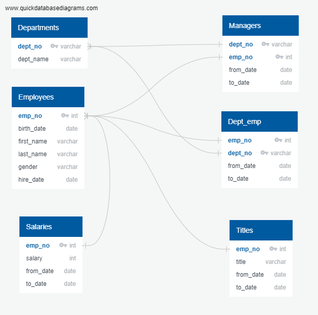
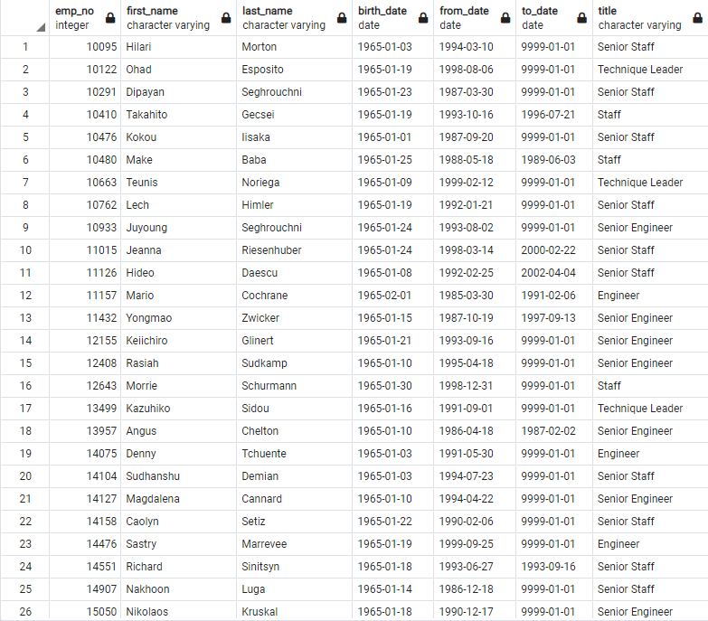
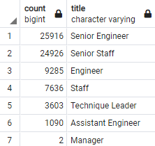

# Pewlett-Hackard Analysis

## Background

This study was performed to assist the large-scale company, Pewlett-Hackard, in determining the retirement eligibility of their employees. Pewlett-Hackard is expecting the “baby boomer” generation to be retiring within the next few years and need to prepare for the upcoming loss of employees. To do this, the employee data has been sorted based on current employment status and date hired, while filtering out recurring employee names due to promotions. With the retirement data acquired, Pewlett-Hackard also requests that the data be further analyzed to determine how many soon-to-retire employees are eligible to be offered a mentorship position for the new and incoming employees. A standard ERD was developed to better visualize the data relationships.

# Resources
Data Sources: 
departments.csv
dept_emp.csv 
dept_manager.csv 
employees.csv 
salaries.csv 

Software: 
SQL
PostgreSQL
pgAdmin

## Results
To begin the data analysis, a standard ERD was developed to better visualize the data relationships.

The analysis of the employee data from Pewlett-Hackard revealed the following information regarding retirement status:
-	There are a total of 72,458 employees eligible for retirement within the next few years
-	2 of the retiring employees are managers
-	50, 824 of the retiring employees are in senior level positions
-	1,940 employees are eligible for the mentorship program

## Summary

Pewlett-Hackard is a large company, and it is reasonable to expect a large loss of employees when each generation reaches retirement age. Based on the data analysis, it is smart for management to investigate retirement status before 72, 458 employees retire and leave these jobs open. Pewlett-Hackard is going to need to go through an extensive and large hiring process to prepare for the upcoming “silver tsunami” of retirees. Within the 72,458 retiring employees, 1,940 meet the requirements to be mentors for the incoming new employees.  Though there are many that meet the requirements, this is still only 2.68% of the employees that will be retiring and leaving empty positions. This is a rather serious concern. To handle this, it is recommended that the company consider using these mentorships in a group learning setting. A second issue brought about through analysis is the number of managers within the company. There are five current managers, despite there being 9 different departments. This is concerning on its own, but more so when taking into consideration that of the retiring employees, two were managers. This would then leave the company with a total of 3 managers for 9 departments. Any company would struggle to maintain balance and order with so few managers. This could also cause a large issue with the new employees, as new employees often refer to their managers for any concerns or questions. This could potentially result in poorly trained and unknowledgeable employees. 
